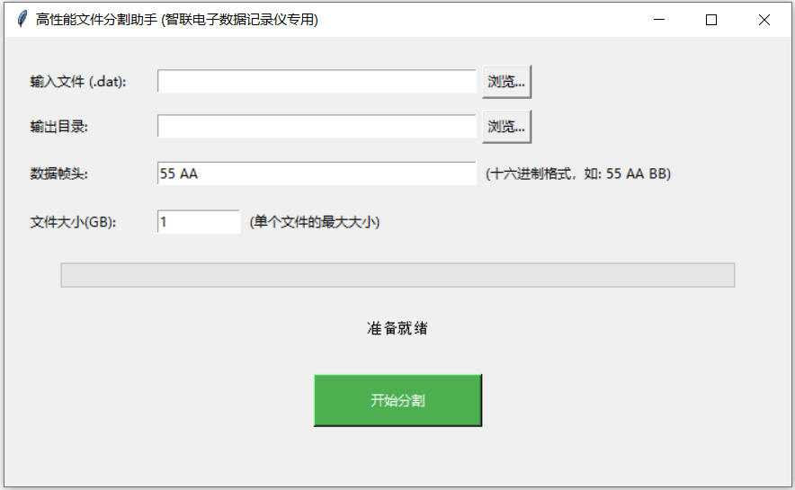

# 高性能文件分割助手

在使用智联电子数据记录仪时，如果一次存储数据过多，通常会生成一个超大文件，有可能超过4GB，这对于某些不支持实时加载数据的软件来说存在处理难度。为了解决该问题，智联电子推出了高性能文件分割助手。

本软件是一个切分大文件的专用工具，用于将大文件按照数据帧头切割成多个小文件。

## 软件界面

## 设计思想

该软件设计的基本思想是化繁为简，专工专用。

文件拆分的原理是基于数据帧头，按照设定的文件大小遍历分割处的数据帧，确保一帧数据不会被截断到两个文件

## 使用步骤

第一步，选择要切分的`.dat`文件，软件会以只读方式打开该文件，不用担心该文件被修改

第二步，选择待输出目录，确保输出目录有足够多的空间，输出文件大小和输入文件大小是一致的

第三步，设定帧头，默认是`0x55 0xAA`，十六进制低字节优先

第四步，设定单个文件的大小，单位是`GB`

第五步，点击开始分割，等待分割完成即可

